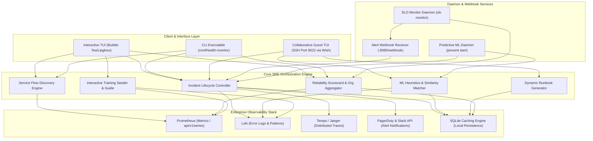

# 🛡️ Health-Monitor: Enterprise Observability & SRE Automation Platform

[](https://golang.org)
[](https://github.com/sanjana/health-monitor-sre-engine)
[](https://grafana.com)
[](#)

Health-Monitor is a production-grade, highly autonomous Systems Observability, Incident Response Automation, and Site Reliability Engineering (SRE) orchestration engine written in Go. Engineered for distributed microservice clusters (including native EKS integration), it consolidates telemetry collection, interactive diagnostics, machine learning heuristics, blameless incident lifecycles, and automated runbook generation into a single system-wide agent.

Unlike standard read-only monitoring dashboards, Health-Monitor bridges the gap between active detection and rapid remediation, introducing terminal-native collaborative SSH sessions, background ML predictive anomaly prevention, and sandboxed reliability training models.

---

## 📌 Technical Architecture & Data Flow

Health-Monitor operates with a modular, highly concurrent structure designed to query and correlate signals from Prometheus, Loki, and Tempo, persisting records in an isolated SQLite database, and notifying administrative channels (PagerDuty, Slack).

### System Component Interactions



---

## 🛠️ Core Technology Stack

*   **Systems Core**: **Go (Golang 1.22+)** for extreme concurrency, safety, and low resource overhead.
*   **Terminal Interface**: **Bubble Tea (Charm CLI)**, **Lipgloss**, and **Wish** for obsidian-themed, hardware-accelerated, and SSH-tunneled multi-user terminal UIs.
*   **Observability Platform**: Native APIs for **Prometheus** (metrics ingestion), **Grafana Loki** (log correlation), **Tempo & Jaeger** (trace analysis).
*   **Machine Learning**: Dynamic keyword tokenizer, semantic similarity engine, and anomaly prediction models.
*   **Persistence**: Embedded **SQLite 3** for ultra-fast local incident caching, runbook tracking, and telemetry profiles.
*   **Notification Layer**: **Slack Webhooks**, **PagerDuty API v2**, **SMTP Email Servers**, and **Custom Webhook Endpoints**.
*   **Orchestration & Deployments**: **Docker & Compose** templates, **Kubernetes / EKS manifests**, and **Systemd** background daemon files.

---

## 📂 Codebase Mappings & Internal Directory Reference

To provide absolute developer-level transparency, the following is a detailed directory map linking Health-Monitor's packages to their files, underlying components, and Go architectural functions:

```
health-monitor/
├── cmd/
│   └── health-monitor/
│       └── main.go                 # Core Application Entry Point
├── internal/
│   ├── alert/                      # AlertManager Daemon Endpoint
│   │   ├── auth.go                 # Bearer Token Webhook authentication
│   │   ├── server.go               # HTTP API listener and routing logic
│   │   ├── secure_handler.go       # Rate limiting and CORS safety policies
│   │   └── generator.go            # Dynamically generated Alert payloads for validation
│   ├── analyse/                    # Low-Level Diagnostic Collectors
│   │   ├── api_latency/            # API Response latency profiling and regression checks
│   │   ├── apm/                    # mini-APM metric correlation logic
│   │   ├── disk/                   # High-frequency disk utilization and I/O rates
│   │   ├── gpu/                    # NVIDIA/SMI hardware metrics extraction
│   │   ├── infra/                  # Kubernetes Cluster health and Node validations
│   │   ├── logs/                   # Advanced Loki log analysis and Elastic aggregator
│   │   ├── prometheus/             # Adaptive metrics probing via /api/v1/series
│   │   ├── tracing/                # Tempo & Jaeger distributed traces extraction
│   │   ├── system/                 # Host CPU core queues and memory states
│   │   └── zombies/                # Kernel zombie process trackers
│   ├── audit/                      # Administrative Audit Recorder
│   │   ├── logger.go               # Standardized secure JSON audit logs writer
│   │   └── types.go                # Security event classification schemas
│   ├── checks/                     # High-Level Orchestrated Health Scripts
│   │   ├── disk.go                 # Executable Disk limits validation script
│   │   ├── memory.go               # Memory threshold checks coordinator
│   │   ├── zombies.go              # Interactive zombie reaping and alerts
│   │   └── infra.go                # K8s status query validation check
│   ├── config/                     # Profile & Setting Lifecycle Manager
│   │   ├── config.go               # YAML configuration loader and structures
│   │   ├── profile.go              # Profile switcher and environment validator
│   │   ├── secrets.go              # Token and password encryptor (0600 paths)
│   │   ├── watcher.go              # Real-time config hot-reloading watcher
│   │   ├── wizard.go               # Interactive console configuration onboarding
│   │   └── wizard_teams.go         # Dynamic preset allocator for team sizes
│   ├── ml/                         # Machine Learning Predictor Stack
│   │   ├── predictor_daemon.go     # Background telemetry scan and pattern detector
│   │   ├── search.go               # Text clustering and semantic vector parser
│   │   └── lifecycle_recorder.go   # Anomaly timeline state persistence
│   ├── notify/                     # Outbound Alert Dispatcher
│   │   ├── slack/                  # Slack Rich Block formatters and retry pipelines
│   │   └── pagerduty/              # PagerDuty Event V2 payload compiler
│   ├── runbook/                    # Automated Playbook Generators
│   │   ├── analyzer.go             # Signature matcher mapping logs to incident patterns
│   │   ├── generator.go            # Markdown step-by-step troubleshooter generator
│   │   └── store.go                # Directory persistence and filesystem tracking
│   ├── scorecard/                  # Reliability & SLA Grade Calculations
│   │   ├── service.go              # Single service SLO and error budget statistics
│   │   └── tui.go                  # Org-level multi-profile aggregated scorecard TUI
│   ├── slo/                        # Service Level Objective Monitor
│   │   ├── monitor_handler.go      # Error budget burn calculator daemon
│   │   └── service.go              # Real-time metric queries evaluator
│   └── tui/                        # Obsidian Bubble Tea TUI
│       ├── interactive_tui.go      # Multi-page responsive view event loop
│       ├── tui_datasource.go       # Mock & real Prometheus state controller
│       └── tui_styles.go           # Bespoke glassmorphism CSS-style layout tokens
```

---

## ⚡ Core CLI Commands & Sub-commands Reference

Health-Monitor uses a highly structured CLI hierarchy to execute checks, manage incidents, invoke wizards, query telemetry, and deploy daemons.

### 1. Initialization & Discovery

#### Dynamic Infrastructure Discovery (`--init`)
Queries target EKS/K8s environments, executes dynamic PromQL scans on Prometheus, validates working metric names, and constructs production-ready profiles.
```bash
# EKS Clusters (Must preserve AWS credentials in sudo environment)
sudo -E ./health-monitor --init --infra eks --kubeconfig ~/.kube/config --profile production-cluster

# Local Kubernetes Discovery
sudo ./health-monitor --init --infra kubernetes --kubeconfig ~/.kube/config --profile staging-cluster
```
*   **What this does internally**:
    1.  Probes the Prometheus endpoint `/api/v1/series` to identify exact reporting metrics.
    2.  Identifies service identifiers (e.g. `app`, `job`, `service`, `kubernetes_namespace`) dynamically.
    3.  Validates and computes baseline metrics over a 7-day query window.
    4.  Generates isolated profiles inside `/etc/health-monitor/`.

#### Interactive Team Preset Wizard (`--wizard-team`)
Bootstrap structured o11y setups using standard operational models designed for specific team sizes.
```bash
# Launch the role-based Interactive Setup Wizard
sudo ./health-monitor --wizard-team

# Non-interactive preset bootstrapper
sudo ./health-monitor --wizard-team --preset microservices --profile core-platform
```
*   **Available presets**:
    *   `small-team` (1-5 SREs): Focused on critical services and basic alert delivery.
    *   `medium-team` (5-15 SREs): Maps standard dependencies, latency percentiles, and multi-service flows.
    *   `devops-team` / `sre-team`: Custom dashboards mapping container workloads, disk I/O, error budgets, and P99 latency regressions.

---

### 2. Incident Management Lifecycle

Manage system incidents, correlate diagnostics, log events, and generate RCA postmortems.

```bash
# Start an incident manually with automatic o11y correlation
sudo health-monitor incident start \
  --service billing_api \
  --title "Payment Gateway Response Degradation" \
  --severity P1 \
  --description "95th percentile latency exceeded 2.5s"

# List incidents with active state filters
health-monitor incident list --state open --profile core-platform

# Perform an interactive 15-field RCA Resolution with toil tracking
sudo health-monitor incident resolve \
  --id INC-20260220-123456 \
  --summary "Database connection pool scale-out complete" \
  --root-cause "Connection pool exhaustion under heavy traffic spikes" \
  --fix "Increased MaxOpenConns configuration and deployed pgBouncer proxy" \
  --category dependency \
  --component postgres_db \
  --toil-minutes 45 \
  --toil-category database_triage \
  --downtime 12

# Generate a comprehensive, blameless Markdown postmortem report
health-monitor incident postmortem --id INC-20260220-123456
```

---

### 3. Automated Runbooks & Playbooks

Health-Monitor uses its pattern recognition engine to automatically analyze failure states, compare logs with historical records, and construct interactive markdown playbooks.

```bash
# Query pattern matches for an active incident
sudo health-monitor runbook suggest INC-20260220-123456

# Generate a high-fidelity troubleshooting runbook with RCA data
sudo health-monitor runbook generate --incident INC-20260220-123456 --save
```
*   **RCA & Historical Analysis Injection**: When playbooks are compiled, the engine queries the SQLite cache to identify:
    *   The frequency of this specific pattern (e.g. `postgres_connection_timeout` occurred 3 times).
    *   What went well, what could be better, and exact command configurations executed in previous successful recoveries.

---

### 4. ML Predictive Anomaly Prevention

The `prevent` CLI controls a highly optimized background daemon that maps live metric drifts and Loki error patterns against historical incident signatures.

```bash
# Start the predictive prevention daemon ticking every 5 seconds
sudo ./health-monitor prevent start --profile production --interval 5s --background

# Start daemon with historical data backfill on startup
sudo ./health-monitor prevent start --profile production --backfill 15m --background

# List actively detected predictions and confidence scores
health-monitor prevent list --profile production

# Describe the root cause and recommended actions of a prediction
health-monitor prevent describe PRED-123456789
```

---

### 5. Multi-User Collaborative SSH Tunnels

Host real-time, terminal-native cooperative sessions directly on your server during critical outages using embedded SSH layers.

```bash
# Start a collaborative incident triage session on port 9022
sudo health-monitor incident view --tui --collaborative --ssh-port 9022 --id INC-20260220-123456
```
*   **Join Token Security Model**: To prevent unauthorized access, the server generates a cryptographically secure 12-character **Join Token** upon initialization. Remote SREs joining via standard SSH must provide this token via the secure terminal prompt:
    `ssh guest@server-ip -p 9022`
*   **NAT Traversal Patterns**:
    *   *Direct Connect*: Standard public-facing IPs.
    *   *Reverse SSH Tunneling (Behind NAT)*: Host initiates an outbound reverse connection: `ssh -R 9022:localhost:9022 remote-user@bastion-host`. Remote guests connect via localhost: `ssh localhost -p 9022`.

---

### 6. Reliability Scorecard & Org Aggregator

```bash
# Launch interactive scorecard TUI for current profile
sudo health-monitor scorecard

# NEW: Aggregated Organization-Wide Reliability Scoreboard
sudo health-monitor scorecard --org --env prod
```
*   **Service-Density Weighted Health Score**: Calculates a global index where teams with high service density are weighted higher:
    $$\text{Global Health} = \frac{\sum (\text{Profile Score} \times \text{Service Count})}{\text{Total Organizational Services}}$$
*   **Error Budget Burn Rate**: Aggregates the burn rate index across the fleet:
    $$\text{Global Burn Rate} = \text{Avg}\left(\frac{100 - \text{Availability}}{100 - \text{SLO Target}}\right)$$

---

### 7. Interactive Guided Tour & SRE Training System

Novice SREs can learn standard systems procedures directly on an isolated sandbox seeder that simulates cascading outages.

```bash
# Launch interactive Guided Tour CLI console
health-monitor guide
```
*   **Interactive SRE Labs**:
    *   `Label Mystery Lab`: Seeders inject metric label drifts (e.g. Prometheus labels shift from `service` to `app`), and training guides prompt operators to debug using internal configuration checkers.
    *   `Cascading Failure Lab`: Latency triggers are seeded in payment dependencies, and guides walk operators through downstream tracing.

---

## 🛠️ Sandbox Demo Mode

Health-Monitor features an isolated, zero-dependency sandboxed `demo` mode designed to showcase all features (TUI dashboards, Incident RCA, ML prediction description, HTML exports) without any active telemetry backend.

```bash
# Launch the fully interactive TUI populated with demo data
health-monitor demo

# Output a static CLI dashboard summary (perfect for scripts/headless environments)
health-monitor demo --force-cli
```

---

## 🔧 Production Deployment Guide

For optimal reliability and system-wide tracking, the Health-Monitor agent should be deployed as a system-level background daemon using `sudo` privileges.

### System Directory Layout
*   **Profiles Path**: `/etc/health-monitor/profiles/*.yaml`
*   **State & Incident Storage**: `/var/lib/health-monitor/state/`
*   **Secrets Directory**: `/etc/health-monitor/` (Must be set to `0600` permissions)

### Systemd Service Configuration
Create the service descriptor at `/etc/systemd/system/health-monitor.service`:

```ini
[Unit]
Description=Health-Monitor Observability & Alerting Daemon
After=network.target

[Service]
Type=simple
User=root
WorkingDirectory=/var/lib/health-monitor
ExecStart=/usr/local/bin/health-monitor alert listen --port 8080 --auth-token /etc/health-monitor/webhook.token
Restart=always
RestartSec=5s
StandardOutput=journal
StandardError=journal

[Install]
WantedBy=multi-user.target
```

Apply and activate:
```bash
sudo systemctl daemon-reload
sudo systemctl enable health-monitor
sudo systemctl start health-monitor
sudo systemctl status health-monitor
```

---

## 🔒 Security & Compliance Model

1.  **Isolated Secret Files**: Basic authentication credentials and Bearer Tokens are stored in dedicated `0600` permission configuration files, segregated from the primary environment declarations.
2.  **SHA-256 Hashed Identifiers**: The `/feedback` TUI automatically anonymizes user metrics, generating securely hashed Machine IDs before outbound network submission.
3.  **Strict Token Auth on Webhooks**: Incoming Prometheus/Grafana alert payloads are protected by mandatory token-based request authentication.

---

## 👨‍💻 Developer & Contributor Guide

Verify local builds, compile scripts, and run test suites before git commits:

```bash
# 1. Validate Go module integrity
go mod tidy
go mod verify

# 2. Run profile integration tests
go test -v ./test/...

# 3. Execute the diagnostic verification script
./final_build_test.sh
```

---

## 📄 License

Proprietary - Developed with 🧡 by Sanjana Mahajan & the Sofueled Systems Team. All Rights Reserved.
